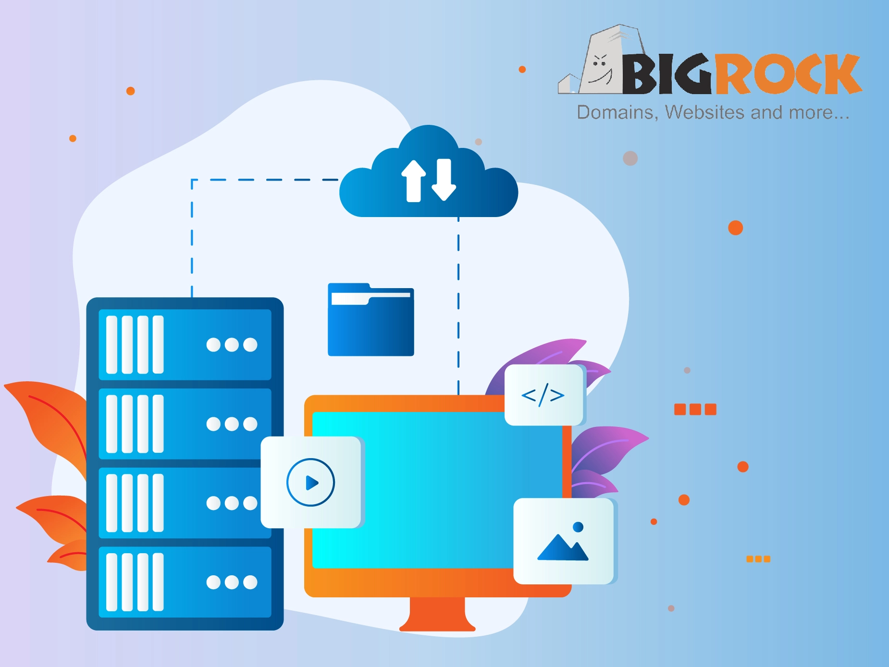

# 印度最值得选择的9家云主机服务商（2025年版）

你知道吗？如果你的网站只托管在一台服务器上，突然的故障可能导致严重的宕机和业务中断。但别担心，我们有解决方案。

本文为你盘点**印度最佳云主机服务商**，它们在本地和全球都设有可靠的数据中心。通过这些云服务，你的网站内容会分布在多台服务器上，确保**始终在线、始终快速、始终可访问**。我们不仅列出了9家顶级云主机平台的核心功能和易用性，还详细介绍了它们的价格方案，帮助你做出明智选择。

---

## 什么是云主机？

简单来说，**印度最佳云主机**就是一个**互联的服务器网络**——这些服务器配备了RAM、CPU、带宽和存储空间，用来存放你的网站内容。世界各地的用户都可以通过浏览器向这些服务器发送请求，随时访问你的网站。

最棒的是：如果一台服务器出现故障，其他服务器会继续运行，确保你的网站数据24/7全天候可访问。

有些人可能会混淆**独立服务器**和**云主机**。区别很简单：独立服务器把数据存储在单一位置的一台服务器上；而云主机将数据存储在互联的服务器网络中，一台服务器故障时，另一台会立即接管。

---

## 2025年印度9大云主机服务商

现在你已经了解了云主机的工作原理，下面我们详细介绍9家在印度提供专用网络资源（包括RAM、存储和带宽）的顶级云主机服务商，帮助你的应用和网站持续在线运行。

### 1. BigRock – 印度综合实力最强的云主机

BigRock是专为企业、个人和开发者量身定制的云主机服务商。凭借灵活性和实惠的价格，BigRock提供一系列产品和服务，让用户轻松构建、托管和扩展在线业务。

它提供多种网络工具来增强数据安全性，支持频繁备份和快照捕获，确保快速数据恢复并提供额外保护层。BigRock还提供专用IP、私有服务器配置和内置DDoS防护，让用户全面保护自己的服务器。

👉 [想要稳定高速的云主机体验？立即查看这个全球顶级方案](https://www.vultr.com/?ref=9738262-9J)

**核心特点：**

🔶 BigRock强调速度和99.99%的可用性，提供Varnish缓存等功能确保更快的加载时间，配备高性能硬件  
🔶 通过云主机和VPS选项，用户可以轻松扩展CPU和RAM等网络资源，无需重启服务器  
🔶 共享和云主机配备cPanel控制面板，轻松管理托管账户、邮件和域名  
🔶 BigRock的NVMe SSD存储技术通过在多台服务器上存储数据，确保最大程度的数据冗余，最大限度减少数据丢失  
🔶 多个托管计划提供一键安装WordPress、Joomla和Drupal等热门应用，简化网站设置

**价格方案：**

- **₹479/月（入门SSD）**：托管1个网站，25GB SSD空间，无限带宽，2GB RAM，2vCore CPU，最多75个邮箱账户
- **₹599/月（高级SSD）**：托管50个网站，50GB磁盘空间，4GB RAM，4vCore CPU，无限带宽
- **₹839/月（商业SSD）**：托管约100个网站，100GB SSD，无限带宽，6GB RAM，6vCore CPU

---

### 2. DigitalOcean – 开发者友好的印度云服务器

DigitalOcean提供对开发者友好的云主机平台，以**简单、实惠和灵活**著称。无论你是构建个人项目还是AI应用，DigitalOcean的网络产品都能提供云主机服务，价格实惠，帮助初创企业无缝发展。

DigitalOcean不仅提供硬件，还结合了**性能、可扩展性和支持**，确保你的项目始终按计划运行。

**核心特点：**

🔶 获取Droplets（虚拟机），无缝部署、管理和扩展应用。只需选择符合需求的CPU、内存和存储  
🔶 Kubernetes简化容器管理，轻松部署、管理和扩展容器化应用  
🔶 GPU Droplets提供AI和机器学习任务所需的处理能力，由NVIDIA GPU（包括最新的H100）驱动，非常适合托管  
🔶 托管数据库支持MySQL、PostgreSQL和MongoDB，提供自动备份、自动扩展和内置安全性，随业务增长平滑扩展  
🔶 负载均衡器通过在多个Droplet或Kubernetes集群之间分配流量来优化性能，确保全球用户获得快速可靠的体验  
🔶 对象存储解决方案非常适合托管大量数据（如图像和视频），块存储卷为Droplets提供可扩展的高性能存储

---

### 3. Hostinger – 印度性价比最高的云服务器

Hostinger的AI驱动云主机有很多亮点！它为希望以灵活性、速度和可靠性托管网站的用户提供强大且用户友好的解决方案。

Hostinger的云主机套餐非常适合根据网站需求扩展，提供增强的安全性、顶级性能和全天候专家支持。

凭借**99.99%的正常运行时间保证**和**30天退款政策**，Hostinger云主机提供安全可靠的托管环境。

**核心特点：**

🔶 使用HTTP协议、NVMe存储和专用IP，确保闪电般的页面加载速度。你的网站速度可提升4倍，为访客提供流畅的浏览体验  
🔶 不用担心数据丢失！Hostinger提供自动每日备份，保护你的文件和数据库。一键即可恢复网站  
🔶 在印度战略性布局数据中心，Hostinger保证99.9%的可用性！无论访客身在印度何处，你的网站始终在线  
🔶 提供基于AI的网站构建器，通过拖放功能轻松创建精美网站，结合AI SEO工具、热图和文案撰写工具，打造专业网站  
🔶 每个计划都包含无限的免费SSL证书和带宽！你的网站安全无虞，可以零成本处理大流量。轻松保护敏感数据并提升SEO  
🔶 提供全天候云LiveChat技术支持，确保立即解决遇到的任何问题。Hostinger的托管服务让你专注于业务，技术问题由他们处理  
🔶 随着业务增长，托管资源也随之增长！一键轻松升级服务器资源（包括RAM、CPU和磁盘空间），让你的网站能够处理更大流量

---

### 4. ScalaHosting – 印度最适合初学者的云主机

ScalaHosting提供功能丰富的云主机平台，旨在为各种规模的企业用户提供可扩展性和易管理性（通过sPanel）。

ScalaHosting强调可扩展性，允许用户根据个人需求定制托管服务，同时保持高标准的性能和安全性。

ScalaHosting提供**自管理云主机**，用户可以通过SPanel控制服务器的各个方面，这是一个简化服务器管理的控制面板。

**核心特点：**

🔶 允许用户升级资源，只为所需付费！无论是CPU、RAM还是存储，用户都可以一键调整资源分配  
🔶 SPanel是ScalaHosting的免费综合控制面板，简化云管理。通过简单的界面，用户可以管理文件、数据库、邮箱账户等，无需任何技术难题  
🔶 99.95%的可用性保证确保数据在不同服务器上全天候可用。如果硬件故障，服务器会自动转移到正常节点，确保24%的零宕机  
🔶 10Gbps冗余网络配备多个上行链路，确保快速数据传输和可靠性！用户享受100%的网络性能，由优质资源支持，实现稳定可靠的服务器访问  
🔶 用户可以从美国和欧洲的多个数据中心中选择，通过AWS合作伙伴关系还有更多选项。这种灵活性让企业能够在更接近目标群体的地方部署服务器，减少延迟并改善用户体验  
🔶 自管理服务器在订单完成后30秒内立即配置，让用户几乎可以立即访问新服务器。还可获得服务器管理工具、资源升级和资源使用监控  
🔶 用户可以运行各种应用程序，从Apache和Nginx等Web服务器到MariaDB等数据库，以及PHP服务器等流行的托管工具和框架，在一个平台上支持用户的多样化需求

---

### 5. InMotionHosting – 低价格高配置

InMotion Hosting是印度最佳云主机列表中的一员，提供出色的托管解决方案，满足各种业务需求。

他们的云主机平台专为可扩展性、灵活性和高性能而设计，适合托管关键应用程序和网站。

InMotion Hosting的云服务提供99.90%的可靠运行时间、DDoS攻击保护和易用的管理工具。用户可以完全控制托管环境，同时享受稳定的安全系统和支持。

**核心特点：**

🔶 获得100%可用的云主机，具有自动故障转移和硬件冗余。这意味着如果任何硬件部分出现故障，系统会自动切换到备用硬件，确保你的网站保持在线和可访问  
🔶 InMotion的主要优势之一是可扩展性！用户可以添加或删除CPU、RAM和存储等资源，以适应流量高峰。这种灵活性让用户只为所需资源付费  
🔶 安全至上！Inmotion提供免费DDoS保护。这有助于进一步保护网站免受DDoS攻击，这些攻击可能因流量而导致服务器崩溃。DDoS保护确保网站即使在攻击尝试期间也保持可访问  
🔶 提供用户友好的管理工具，包括cPanel用于服务器管理和一键管理网站和服务器资源的工具，让用户更轻松地处理服务器任务，无需广泛的技术知识  
🔶 对于需要高级控制的用户，InMotion Hosting提供完整的root访问权限，允许完全自定义服务器设置，使用户能够完全按照需要配置托管环境。这对开发者来说是理想选择  
🔶 云服务器配备顶级硬件，确保用户获得快速的加载时间。基础设施旨在处理大流量和资源需求，适合需要速度的网站  
🔶 数据丢失可能是一个严重问题！为了避免这种情况，InMotion Hosting在其云主机服务中提供自动备份选项。这确保数据定期备份，并且在意外丢失或损坏的情况下可以轻松恢复

---

### 6. HostGator – 印度最用户友好的云服务器

让我们看看HostGator这个印度云主机平台能为你提供什么！它主要设计用于为任何规模的网站提供快速且可扩展的云主机。

HostGator主要提供速度和性能，配备SSD驱动的服务器和预集成缓存，以确保最佳的网站性能。

作为网络托管行业的可信品牌，HostGator提供的云主机计划非常适合寻求灵活性、安全性和处理大流量能力的企业。

**核心特点：**

🔶 利用SSD NVMe存储，与传统硬盘相比提供更快的读写速度。这导致更快的加载时间，为你的访客确保流畅的浏览  
🔶 允许一键轻松升级CPU、RAM和存储等网络相关资源。你的网站是否经历流量激增？或需要更多资源？在这种情况下，HostGator的可扩展计划可以快速无缝地更新  
🔶 在HostGator中，缓存是内置的并针对服务器速度进行了优化。这意味着你的网站内容浏览和冲浪更快，缩短页面加载时间并改善用户体验，特别是在高峰时段  
🔶 HostGator处理服务器管理的所有方面，包括配置、服务器补丁和快速维护。这让你可以专注于发展业务，同时确保托管环境平稳运行  
🔶 每个云主机计划都来自HostGator，包括免费SSL证书以保护数据并提升SEO。升级到启用SSL的网站也是免费的，为你和你的访客提供增强的安全性和安心  
🔶 包含行业领先、易于使用的cPanel，使管理域名、邮箱账户、文件和数据库变得无缝。无论你是初学者还是专业人士，cPanel的简单界面都让你轻松管理一切，包括网站管理  
🔶 支持团队全天候可用，帮助你解决任何问题或技术难题。无论你需要设置帮助还是故障排除，他们屡获殊荣的LiveChat支持确保你永远不会孤单

👉 [寻找全球覆盖、性能卓越的云主机？这个方案值得一试](https://www.vultr.com/?ref=9738262-9J)

---

### 7. Kamatera – 印度无限定制的可扩展云服务

Kamatera以其灵活性、可扩展性和强大的基础设施而闻名，是印度顶级免费云主机提供商之一。

拥有超过二十年的经验，Kamatera满足寻求可配置、高性能云解决方案的企业和开发者的需求。

该平台的云服务提供从简单云服务器到复杂解决方案的广泛服务，所有这些都通过直观的控制面板或API进行管理。

用户可以轻松升级CPU、RAM和存储，确保只为所需付费。Kamatera还强调可用性和可靠性，数据中心遍布全球，确保最低延迟和99.95%的保证正常运行时间。

该平台为新用户提供**30天免费试用**，让他们无需任何初始财务承诺即可探索其功能。这使其成为各种规模企业的有吸引力的选择，特别是那些资源需求变化的企业。

**核心特点：**

🔶 允许用户轻松向上或向下扩展服务器资源。无论你需要添加更多CPU能力、RAM还是存储，Kamatera的云平台都提供灵活的解决方案来满足各种需求  
🔶 提供用户友好的管理控制台，简化服务器配置。此外，API允许无缝集成，为技术精通的用户提供对服务器的更多控制。Kamatera的界面设计简单，降低了复杂性  
🔶 Kamatera的23个以上数据中心位于北美、欧洲、亚洲和中东，确保全球用户的低延迟，使应用程序能够更接近最终用户部署并更快地访问  
🔶 没有固定价格！用户可以在按月付费或基于小时计费的按使用付费模式之间选择，这意味着用户只为消耗的资源付费，并可以随时取消订阅  
🔶 Kamatera通过电话、聊天和电子邮件提供全天候客户支持，确保用户在需要时获得帮助。这种全天候技术支持由经验丰富的专家提供，他们可以随时帮助解决问题  
🔶 云防火墙、安全私有网络和数据加密等功能用于保护用户的数据和应用程序，对于处理敏感数据的企业至关重要，从而保护你的网站免受DDoS攻击、恶意软件和数据安全漏洞等威胁  
🔶 支持多种操作系统选项——超过100种可立即部署。此外，还提供负载均衡模块、扩展备份和完全托管服务等附加组件，让用户可以根据特定需求定制云基础设施

---

### 8. Vultr – 全球高性能云服务

Vultr是一个提供各种网络相关服务的云主机平台，适应不同的计算需求。以其高性能、可扩展性和全球覆盖而闻名，Vultr提供各种解决方案，包括云计算、裸机服务器和云GPU选项。

这些服务设计灵活高效，满足个人开发者和寻求强大可靠基础设施的大型企业的需求。

Vultr还提供什么？它允许用户安排定期备份并创建实例快照，确保额外的数据保护和恢复层。

Vultr提供灵活的网络功能，如专用IP、私有网络和DDoS保护，帮助保护和定制网络。

通过小时计费方案，Vultr让用户只为消耗的资源付费。这种灵活性适合工作负载变化或短期需求的项目。

**核心特点：**

🔶 高频云计算基础设施以更高的速度提供高性能，非常适合需要更快页面响应时间的项目。高性能处理器确保最佳性能，适合需要快速处理的网站和应用程序  
🔶 为了满足更大的处理需求，Vultr提供配备专用高性能处理器的优化云计算服务器，可以处理要求苛刻的工作负载。它们提供专用资源，转化为更高的可靠性和性能  
🔶 Vultr的裸机服务器为单租户提供高性能计算资源，让用户完全控制其环境。采用高性能AMD和Intel处理器构建，裸机服务器提供高速度，没有任何共享资源，确保最大性能和安全性  
🔶 专为专业工作负载设计，Vultr的云GPU服务器提供强大的能力和灵活性。结合云计算、裸机和Kubernetes引擎，云GPU为高级项目提供出色的可扩展性和适应性  
🔶 Vultr在全球拥有超过32个数据中心，特别是在印度有一个。允许用户在更接近目标群体的地方部署应用程序，减少延迟并提高性能，确保无论地理位置如何都能快速可靠地访问服务器  
🔶 提供更广泛的操作系统选择，包括CentOS、Debian和Ubuntu等流行的Linux，以及Windows和FreeBSD。该平台还支持自定义ISO镜像，允许用户部署满足其特定要求的任何操作系统  
🔶 Vultr的简单控制面板提供对各种功能的轻松访问，如重新安装操作系统以及查看控制台访问。该平台还提供强大的API，使用户能够自动化和管理服务器

---

### 9. HostArmada – 初学者的低价选择

HostArmada是一家领先的云主机提供商，专注于基于云的解决方案，强调速度、安全性和可靠性。

服务器配备最先进的云技术，为用户提供高效的托管服务。

他们的云服务包括共享主机、VPS主机、经销商主机和专用CPU主机，所有这些都旨在满足客户的多样化需求。

HostArmada强调通过LiveChat提供出色的客户服务和用户友好的环境，使其成为希望建立强大在线形象的人的热门选择。

**核心特点：**

🔶 网站加载速度是关键的SEO排名因素！HostArmada的服务器确保快速的加载时间，有助于改善用户体验并提高搜索引擎排名  
🔶 可靠性是HostArmada服务的核心！他们承诺99.9%的正常运行时间保证,确保托管的网站保持可访问。为了保证这一声明，他们全天候监控基础设施，随时准备解决可能导致停机的任何问题  
🔶 实施多层安全协议来保护其托管环境。他们基于AI的安全服务旨在适应各种类型的恶意攻击，确保网站安全  
🔶 技术支持团队全天候可用，随时准备帮助客户解决可能遇到的任何问题。无论是网站故障还是关于应用程序安装的问题，他们的认证专家都会快速响应，通常在几分钟内解决问题  
🔶 提供各种定价计划以满足不同需求。定价灵活性使其对初创企业、小型企业和大型企业都可访问  
🔶 为了改善用户体验，HostArmada提供由cPanel支持的简单控制面板。这个用户友好的界面使客户能够轻松管理其网站、域名和托管设置，无需广泛的技术知识

---

## 总结

我们看到，在印度选择合适的云主机解决方案可以帮助你的业务提升到新水平，提供当今动态数字世界所需的灵活性、可扩展性和可靠性。

从Kamatera和HostGator等主要参与者到本地提供商，有如此多的选项可供选择。

在做出选择时，应考虑可扩展性、性能、安全性、客户支持、价格和合规性等因素，以确保你的托管需求得到充分满足。

最终，选择最佳云主机提供商是你能做出的最佳决定，因为它带来显著的好处，使你的业务能够利用云技术的全部潜力。为什么Vultr适合各种规模的企业？因为它提供全球数据中心覆盖、灵活的资源配置和按小时计费的透明定价——👉 [立即体验Vultr的高性能云服务](https://www.vultr.com/?ref=9738262-9J)。
